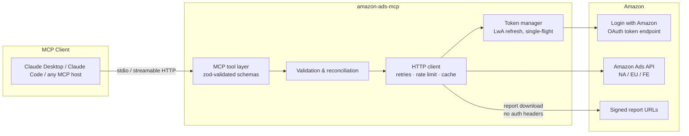
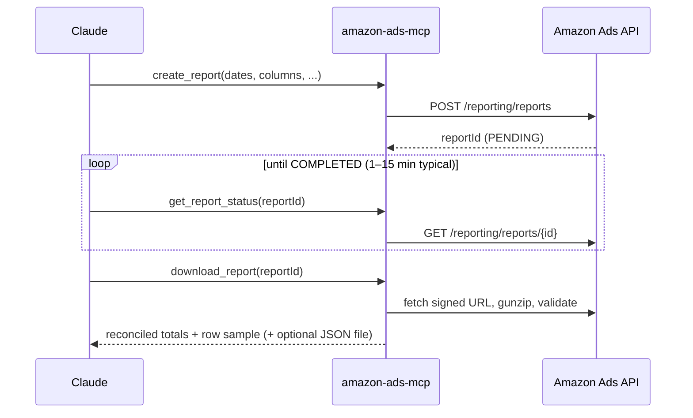

# amazon-ads-mcp

**Production-ready MCP server connecting Amazon Advertising data to Claude and any MCP-compatible client.**

Query Sponsored Products, Sponsored Brands and Sponsored Display structure and performance, run Amazon DSP reports, and execute Amazon Marketing Cloud (AMC) SQL workflows — all in natural language, with live data straight from the Amazon Ads API. No mock data, ever.

[](https://github.com/OWNER/amazon-ads-mcp/actions/workflows/ci.yml)
[](LICENSE)
[](package.json)

---

## Features

- **23 read-only tools** across profiles, Sponsored Products (v3), Sponsored Brands (v4), Sponsored Display, unified Reporting v3, Amazon DSP, and AMC
- **Data accuracy by construction** — every number comes live from Amazon; downloaded reports pass integrity checks (column presence, non-negative metric invariants, daily date-coverage) and totals are computed server-side so the model never sums truncated samples
- **Resilient HTTP layer** — OAuth token refresh with single-flight de-duplication, client-side token-bucket rate limiting, exponential backoff with jitter, `Retry-After` honoring on 429, one automatic re-auth on 401
- **Fast on large accounts** — TTL response cache for entity reads, `nextToken`/index pagination passthrough, parallel tool calls are safe (rate limiter serializes the wire)
- **Secure by default** — secrets only via environment variables, redacted from logs, never written to disk; logs go to stderr (stdout is reserved for the MCP protocol)
- **Two transports** — stdio for Claude Desktop / Claude Code, streamable HTTP for Docker or remote deployment
- **Tested** — 36 unit/integration tests including full MCP wire-protocol tests with the Amazon API mocked at the fetch boundary

## Architecture



Async reporting flow (Reporting v3, DSP, AMC all follow it):



## Prerequisites

You need **Amazon Ads API access** (this is Amazon's process, not this project's):

1. An Amazon Ads account (seller, vendor, or agency).
2. A **Login with Amazon (LwA) security profile** with the Amazon Ads API scope approved — apply via the [onboarding guide](https://advertising.amazon.com/API/docs/en-us/onboarding/overview).
3. A **refresh token** generated through the LwA authorization-code grant for your own account ([create authorization grant](https://advertising.amazon.com/API/docs/en-us/getting-started/retrieve-access-token)).

Plus **Node.js ≥ 20** (or Docker).

## Installation

```bash
git clone https://github.com/OWNER/amazon-ads-mcp.git
cd amazon-ads-mcp
npm ci
npm run build
```

### Environment variables

Copy [.env.example](.env.example) and fill it in:

| Variable | Required | Description |
|---|---|---|
| `AMAZON_ADS_CLIENT_ID` | ✅ | LwA client id (`amzn1.application-oa2-client.…`) |
| `AMAZON_ADS_CLIENT_SECRET` | ✅ | LwA client secret |
| `AMAZON_ADS_REFRESH_TOKEN` | ✅ | LwA refresh token (`Atzr\|…`) |
| `AMAZON_ADS_REGION` | ✅ | `NA`, `EU`, or `FE` — must match where the refresh token was issued |
| `AMAZON_ADS_PROFILE_ID` | | Default advertiser profile (else pass `profileId` per tool call) |
| `MCP_TRANSPORT` | | `stdio` (default) or `http` |
| `MCP_HTTP_PORT` | | HTTP port, default `3000` |
| `AMAZON_ADS_RATE_LIMIT_RPS` | | Client-side request ceiling, default `5`/s |
| `AMAZON_ADS_CACHE_TTL_SECONDS` | | Entity-read cache TTL, default `60` (`0` disables) |
| `AMAZON_ADS_MAX_RETRIES` | | Retry attempts for 429/5xx, default `4` |
| `LOG_LEVEL` | | pino level, default `info` (logs go to stderr) |
| `REPORT_OUTPUT_DIR` | | Where `download_report --saveAs` writes files, default `./reports-output` |

### Claude Desktop

Add to `claude_desktop_config.json` (Settings → Developer → Edit Config), or copy [examples/claude_desktop_config.json](examples/claude_desktop_config.json):

```json
{
  "mcpServers": {
    "amazon-ads": {
      "command": "node",
      "args": ["/absolute/path/to/amazon-ads-mcp/dist/index.js"],
      "env": {
        "AMAZON_ADS_CLIENT_ID": "amzn1.application-oa2-client.…",
        "AMAZON_ADS_CLIENT_SECRET": "…",
        "AMAZON_ADS_REFRESH_TOKEN": "Atzr|…",
        "AMAZON_ADS_REGION": "NA",
        "AMAZON_ADS_PROFILE_ID": "1234567890"
      }
    }
  }
}
```

Restart Claude Desktop and ask: *“Run a health check on my Amazon Ads connection.”*

### Claude Code

```bash
claude mcp add amazon-ads \
  -e AMAZON_ADS_CLIENT_ID=… -e AMAZON_ADS_CLIENT_SECRET=… \
  -e AMAZON_ADS_REFRESH_TOKEN=… -e AMAZON_ADS_REGION=NA \
  -- node /absolute/path/to/amazon-ads-mcp/dist/index.js
```

### Docker

```bash
cp .env.example .env   # fill in credentials
docker compose up -d   # streamable HTTP on http://127.0.0.1:3000/mcp
```

The compose file binds to localhost only: the HTTP endpoint deliberately ships **without its own auth layer** (it holds a single advertiser's credentials). For remote access, front it with your own reverse proxy and authentication. For stdio inside Docker: `docker run -i --env-file .env -e MCP_TRANSPORT=stdio amazon-ads-mcp`.

## Example prompts

- “List my advertiser profiles and tell me which marketplaces I'm in.”
- “Show all enabled Sponsored Products campaigns and their daily budgets.”
- “Create a daily campaign performance report for the last 30 days, wait for it, and summarize spend, sales and ACOS by campaign.”
- “Pull a search-term report for May and find queries with clicks but zero purchases.”
- “Which ASINs am I advertising in ad group X?”
- “Run my AMC workflow `path_to_conversion` for last week and give me the download links.”

More in [examples/prompts.md](examples/prompts.md). Full tool reference in [docs/API.md](docs/API.md).

## Data accuracy & reconciliation

- **No mock data.** Every tool hits the live Amazon Ads API; errors are surfaced (with Amazon's request id) instead of silently degraded.
- `download_report` validates each report: requested columns present, invariant metrics (impressions, clicks, cost, sales…) non-negative, and daily reports checked for date-coverage gaps.
- Totals are computed once, server-side, and returned alongside a bounded row sample — the model is explicitly instructed to quote reconciled totals rather than re-sum samples.
- Entity reads are cached for 60 s by default (configurable, or disable with `AMAZON_ADS_CACHE_TTL_SECONDS=0`); report status/downloads are **never** cached.
- Caveat that applies to any Amazon Ads integration: Amazon's own attribution metrics are restated for up to ~14 days after the fact, so a report pulled today can legitimately differ from the same report pulled next week. That is Amazon-side behavior, not a sync bug.

## Verified capabilities vs. assumptions

This project distinguishes what is verified against Amazon's public documentation from what depends on your account's entitlements:

| Area | Status |
|---|---|
| Profiles `/v2/profiles` | ✅ Verified, generally available |
| Sponsored Products v3 (`POST /sp/*/list`, versioned media types) | ✅ Verified |
| Sponsored Brands v4 (`POST /sb/v4/*/list`) | ✅ Verified |
| Sponsored Display (`GET /sd/*`) | ✅ Verified for self-service SD accounts |
| Reporting v3 (`/reporting/reports`, GZIP_JSON async) | ✅ Verified |
| Amazon DSP reports & orders | ⚠️ **Entitlement-gated.** Requires a DSP seat with API access; without it Amazon returns 403. Endpoint media-type versions evolve — pin against [Amazon's DSP docs](https://advertising.amazon.com/API/docs/en-us/) for your account type. |
| AMC workflows/executions | ⚠️ **Entitlement-gated + evolving.** Requires a provisioned AMC instance with your LwA client allow-listed. Endpoint shapes follow the AMC Reporting API; verify against the AMC docs for your instance before relying on them in production. |
| Write operations (create/update campaigns, bids, budgets) | ❌ **Intentionally not implemented** in v1. This server is read/reporting-only to make it safe against production ad spend. PRs welcome behind an explicit opt-in flag. |
| Rate limits | Amazon's limits are **dynamic and undocumented**; this server enforces a client-side ceiling and honors 429 `Retry-After`, but cannot guarantee you'll never be throttled. |

## Development

```bash
npm run dev        # run from source (tsx)
npm test           # vitest suite (36 tests, no network — fetch is mocked)
npm run typecheck  # strict TS
npm run build      # emit dist/
```

See [docs/ARCHITECTURE.md](docs/ARCHITECTURE.md) for module layout and design decisions, and [CONTRIBUTING.md](CONTRIBUTING.md) for workflow. Security policy: [SECURITY.md](SECURITY.md).

## License

[MIT](LICENSE)
